# Relevamiento de Stuky (referencia para completar Stackr)

Objetivo: tomar ideas de Stuky (app.stukysistema.com) para cerrar los huecos de
Stackr **sin perder su simplicidad**. Huecos que marcó el dueño como prioridad:

- **Ganancia de una venta financiada:** cómo se cuenta la ganancia cuando se
  cobra en cuotas o a través de una financiera.
- **Destino de la transferencia:** poder elegir si una transferencia entra a
  una cuenta propia o a la cuenta de una financiera.
- Información que aparece en una pantalla y falta en otra.

Capturas de esta carpeta:

- `panel`, `ventas`, `venta-pago`, `caja`, `permutas`, `cuenta`, `stock` y
  `tecnico`: las que Stuky publica en su landing (stukysistema.com/capturas/…).
- `app-*.webp`: fotogramas de los clips del tutorial "¿Cómo cargo una venta?"
  que trae la propia app (app.stukysistema.com/tutoriales/*.mp4). Son la app
  real con datos de demo de Stuky (sucursal "Casa Central").

---

## Registro y configuración inicial (capturas que pasó el dueño)

- **Registro:** nombre del negocio, nombre, correo, celular de WhatsApp (+54 9,
  validado en vivo) y contraseña con medidor de seguridad. La cuenta recién se
  crea al confirmar el correo; incluye 30 días de prueba.
- **Asistente de 9 pasos** (`/configuracion-inicial?paso=…`), con "Continuar
  más tarde" y guardado automático:
  1. **Cómo trabaja:** local físico, oficina/showroom, online o varias ubicaciones.
  2. **Qué vende:** iPhone, iPhone + accesorios, varias marcas, tecnología,
     servicio técnico u otro. Después se marcan los equipos (iPhone, Mac, iPad,
     Watch, AirPods) y el sistema solo muestra esos.
  3. (No hay captura.)
  4. **Qué quiere ordenar:** stock, caja y ventas, pesos y dólares, permutas,
     servicio técnico, cuentas corrientes o todo.
  5. **Monedas:** una moneda por tipo de producto (Apple en USD, otras marcas
     en ARS). AirPods y accesorios siempre en pesos. Solo se aplica a productos
     nuevos.
  6. **Dólar:** blue o cripto automático (dolarapi.com), o cargado a mano.
     Muestra un ejemplo: "USD 100 se cobra $156.000".
  7. **Garantía y señas:** duración de la garantía (o sin garantía), vigencia
     de la seña (o sin vencimiento) y condiciones de garantía de hasta 4000
     caracteres que salen en los comprobantes. Las señas vencidas no se
     cancelan: solo quedan marcadas.
  8. **Datos del comercio:** logo, nombre e Instagram, que salen en
     comprobantes y presupuestos.
  9. **Cómo nos conoció:** opcional.

## Menú de la app

Dashboard, Reportes · Ventas: Caja, Ventas, Señas · Inventario: Stock, Compras,
Permutas, Servicio técnico · Personas: Equipo/Empleados, Clientes, Cuenta
corriente · Ajustes: Catálogos, **Planes de pago** · Dólar hoy (blue y cripto)
fijo en el menú · Selector de sucursal arriba · Buscador "IMEI, modelo…" (Ctrl K).

## Pantallas

- **Dashboard (panel):**
  - Resumen del período con cuatro números: ventas, facturado (precio de lista
    de lo vendido), cobrado y ganancia.
  - Recuadro "Requiere atención" y bloque "Operación": señas por cobrar,
    compras por recibir, permutas por rutear, stock por identificar.
  - Finanzas: cuentas por cobrar (pesos y dólares separados) y deudas con
    proveedores.
  - Rendimiento por vendedor, producto, categoría y medio de pago.
  - Botón "Tutorial de cobros".
- **Ventas (`ventas.webp`):**
  - Facturado (antes de descuentos y permutas), cobrado ("plata que entró") y
    por cobrar (dividido en entregado y sin entregar), con barra de
    "% de lo vendido ya cobrado".
  - **Ganancia, con la parte "sin cobrar" marcada aparte.** Si hay ventas sin
    costo cargado, la ganancia sale como "provisional".
  - Pérdidas y descuentos.
  - Un chip por medio de pago con cantidad y total.
  - Filtros por período, vendedor, medio de pago y sucursal.
- **Nueva venta (`venta-pago.webp`):**
  - Asistente en pasos: vendedor → producto → permuta → acción → pago →
    confirmar.
  - Medios: efectivo, transferencia, tarjeta, dólar y cripto.
  - "Dividir en dos métodos" y "Monto recibido".
- **Caja (`caja.webp`):**
  - Caja por turno con monto inicial. El "efectivo esperado al cierre" es la
    apertura más las ventas en efectivo.
  - Chips por medio de pago. Cripto se muestra en USD con su equivalente en
    pesos.
  - Movimientos del turno con pago mixto y detalle de la tarjeta
    (ej. "Naranja X - Plan Z", "Débito 1c").
  - Historial de cajas.
- **Permutas (`permutas.webp`):**
  - Cuatro estados: recibidas, en stock, en técnico y todas.
  - Columnas: equipo, batería, valor de la permuta en USD, número de pedido,
    sucursal y estado.
  - Acciones para mandar el equipo a stock o al técnico.
- **Cuenta corriente (`cuenta.webp`):**
  - Solapas: cuentas, por cobrar y por entregar.
  - Deuda viva por antigüedad: vigente, 1-30, 31-60 y +60 días.
  - Cada venta tiene su vencimiento y muestra lo pendiente sobre el total.
- **Stock (`stock.webp`):**
  - Solapas: equipos, accesorios y personalizado. Dentro de equipos: iPhone,
    celulares, Mac y Watch.
  - Stock agrupado por modelo, marcando los que tienen seña.
- **Servicio técnico (`tecnico.webp`):**
  - Tipo de orden: cliente o permuta.
  - Estados: en proceso, listo y en stock. Se registra el costo y quién creó
    la orden.

---

## Relevamiento dentro de la app (30/09/2026)

### Cómo se hizo y qué quedó afuera

- **No se pudo entrar con la cuenta de prueba.** La página de login carga
  (app.stukysistema.com), pero el login, y todo lo que viene después, llama a
  `api.stukysistema.com`. La política de red del entorno de Claude bloquea ese
  host (el proxy responde 403 al CONNECT). Por eso **no se cargaron ventas de
  prueba** ni hay capturas de pantallas con la sesión abierta.
- Lo que sigue sale de dos fuentes públicas que la app entrega a cualquier
  navegador:
  1. **El código del frontend (v0.27.1):** 139 archivos JS con todas las
     pantallas, sus textos, sus fórmulas y lo que cada formulario le manda
     al servidor.
  2. **Los 6 clips del tutorial de venta:** de ahí salen las capturas
     `app-*.webp`.
- **Límite:** la ganancia, lo cobrado y la caja se calculan en el servidor. Del
  frontend se sabe qué muestra cada número y con qué leyenda, pero la
  fórmula exacta del servidor se infiere de esas leyendas.
- **Para completarlo:** agregar `api.stukysistema.com` a los dominios
  permitidos del entorno (menú del entorno → Editar → Acceso a la red) y
  repetir con ventas de prueba reales.

### Mapa de pantallas (rutas del código)

Dashboard · Reportes · Caja (+ Historial y detalle de turno) · Ventas (+
detalle, venta histórica importada) · Señas (`PedidosTab`) · Nueva venta (admin
y vista móvil de vendedor) · Stock (+ artículo y unidad) · Compras (proveedores,
órdenes, lotes) · Permutas (recibidas y catálogo de valores) · Servicio técnico
· Empleados (+ permisos, actividad y sesiones) · Clientes (+ ficha) · Cuenta
corriente · Catálogos · Planes de pago · Configuración · Terminales · Novedades
· Configuración inicial.

---

### 1. Planes de pago y recargo (prioridad)

**Dónde:** Ajustes → Planes de pago, más Configuración → Recargo.

**El precio con tarjeta se arma en tres capas:**

1. **Recargo de lista** (Configuración → Recargo):
   - Es un único % de 0 a 100 sobre el precio contado.
   - Se aplica solo a las categorías que se marcan. Las demás cuestan lo mismo
     con tarjeta que en efectivo.
   - "Precio de lista" = precio contado + recargo.
2. **Interés del plan:** % sobre el precio de lista.
3. **IVA del plan:** % sobre el interés, no sobre el total. Viene en 21 por
   defecto.

**Cada plan** tiene:

- **Marca:** Visa, Mastercard, American Express, Naranja X o la que se escriba.
- **Cuotas:** botones para 1, 3, 6, 9, 12, 18 y 24, o cualquier otra cantidad.
- **Interés % e IVA %.**
- **"Cobrar a precio contado":** saltea el recargo de lista (pensado para
  débito). El interés y su IVA se siguen cobrando.

**Fórmula** (`recargo-*.js`):

```
lista = contado × (1 + recargoLista%)             (o contado, si "a precio contado")
total = lista × (1 + interés% × (1 + IVA%))
cuota = total / cuotas
```

**Ejemplo de la propia app:** $100.000 de contado, con 25% de recargo de
lista, 20% de interés y 21% de IVA:

- $125.000 de lista + $25.000 de interés + $5.250 de IVA = **$155.250**.
- Es decir, **3 cuotas de $51.750**.

**Otros detalles de la pantalla:**

- Vista previa "Así queda el plan" mientras se carga.
- La tasa se edita directo en la tabla.
- Los planes se agrupan por marca.
- Desactivar un plan no tiene vuelta atrás: para reactivarlo hay que crearlo
  de nuevo.
- Sin planes no se puede cobrar con tarjeta.
- La API permite crear planes en lote.
- El dashboard trae un "Tutorial de cobros" de 2 pasos: recargo y planes.

**Lo que no tiene:**

- Comisión o arancel real de la procesadora o la financiera.
- Días hasta que se acredita.
- Cuenta donde se acredita.
- La financiera como algo que se pueda cargar.

Una tarjeta es solo una marca con cuotas y un interés que paga el cliente.

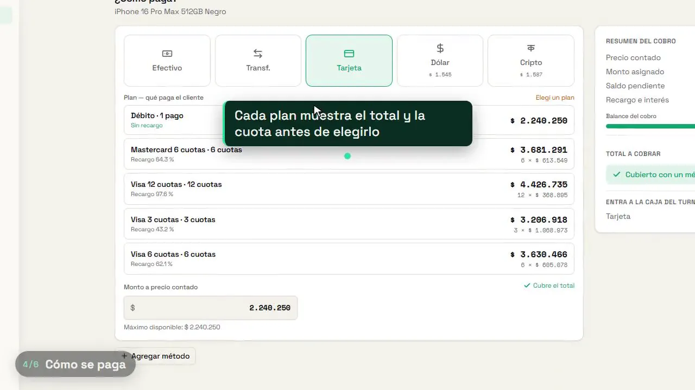

### 2. Cómo cuenta la ganancia de una venta con tarjeta o en cuotas (prioridad)

**En el detalle de la venta** (`VentaDetallePage`) hay dos bloques separados:

- **Ganancia:**
  - Total de la venta (a precio contado) − costo − descuento otorgado =
    **Ganancia** (o **Pérdida**), con el % de margen sobre la venta.
  - Si algún ítem no tiene costo, sale "* la ganancia es parcial".
  - Solo lo ve quien tiene el permiso *Ver costos y ganancia*.
- **Cobrado al cliente:**
  - Precio contado + Recargo lista + Tasa tarjeta = Total cobrado.
  - Debajo, textual: **"El recargo y la tasa compensan el costo de la
    tarjeta; no son ganancia."**

**Conclusiones:**

- **La ganancia de una venta con tarjeta es la misma que si fuera en efectivo.**
  Todo lo que se suma por pagar con tarjeta se da por gastado en la tarjeta.
- Stuky no registra cuánto cobra de verdad la tarjeta. Si el arancel real
  es mayor o menor que el recargo, esa diferencia no aparece en ningún lado.
- Tampoco existe el caso "lo absorbe el local": el recargo siempre lo paga
  el cliente.
- **Lo cobrado:** el total con recargo figura como cobrado el día de la venta
  (el chip "Tarjeta" de la caja). No hay un "por acreditar".
- **El saldo de una seña pagado con tarjeta** se muestra así: Saldo financiado
  + Recargo cuotas + Tasa tarjeta.

**Financiación propia = cuenta corriente** (`app-cuenta-corriente.webp`):

- **Sin interés:** no hay ningún campo de interés.
- **Toma la venta entera:** no se mezcla con otros medios de pago ni lleva
  recargo. Si el cliente deja algo hoy, eso es una seña.
- **Vencimiento:** cada cuenta tiene moneda (ARS o USD) y plazo en días
  (ej. "plazo 60 días"). La venta muestra "Vence el 2/11/2026".
- **Restricciones:**
  - Solo iPhone.
  - El cliente tiene que tener la cuenta habilitada.
  - El empleado necesita el permiso *Fiar y cobrar cuenta corriente*.
- **La ganancia se cuenta el día de la venta, marcada aparte:**
  - En la lista de ventas sale en ámbar, con la leyenda "Pendiente de cobro
    (cuenta corriente)".
  - En el detalle: "Pendiente de cobro (cuenta corriente)".
- **Lo cobrado:** los pagos se asignan a la venta original (Dashboard →
  Cobrado). Reportes separa "Vendido a cuenta corriente — fiado en el
  período: no es plata cobrada" de "Cuotas de cuenta corriente cobradas".
- **Gráfico de ganancia del dashboard:** "solo suma márgenes positivos; las
  ventas con pérdida no se descuentan".

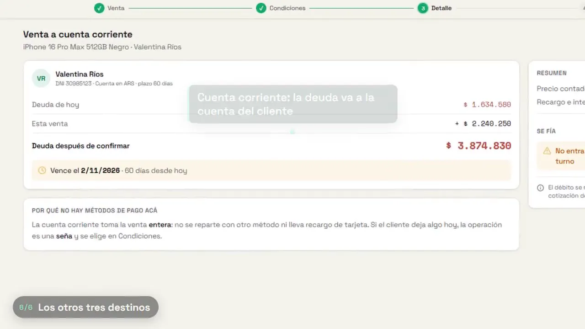

### 3. ¿La transferencia puede ir a la cuenta de una financiera? (prioridad)

**No.** En Stuky la transferencia no tiene destino:

- **Lo que se guarda de cada pago:** `{ metodo, montoBaseArs, planPagoId }`.
- **Medios de pago:** `EFECTIVO`, `TRANSFERENCIA`, `TARJETA`,
  `CUENTA_CORRIENTE`, `DOLAR_FISICO` y `DOLAR_CRIPTO`.
- **No existe** nada que represente una cuenta bancaria, billetera, alias/CBU,
  financiera o procesadora (ni en ventas, ni en caja, ni en configuración).
- **Lo único que hay:** al cobrar el saldo de una seña por transferencia
  aparece "Verifique que la transferencia esté acreditada antes de
  registrar".
- La palabra `FINANCIERA` aparece en el código, pero es el nombre interno de
  la *nota de crédito* a un proveedor. No tiene nada que ver con cobros.
- **En la caja**, la transferencia es solo un chip con cantidad y total. No
  suma al efectivo esperado.

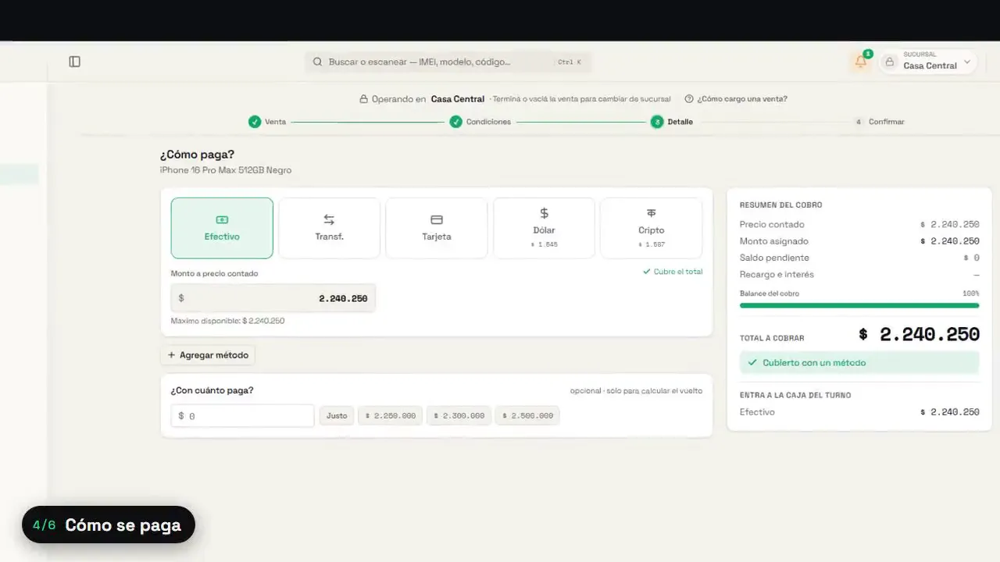

### 4. Nueva venta, paso a paso

**Arriba:** barra "Operando en *Casa Central*". Para cambiar de sucursal hay
que terminar o vaciar la venta. Si la caja está cerrada, no deja vender.

**Los cuatro pasos:**

1. **Venta:**
   - Buscador, lector de código y carrito, con solapas iPhones, Accesorios y
     Otros equipos.
   - El lector identifica la unidad exacta por IMEI.
   - Se elige el vendedor.
   - Cada ítem acepta descuento (% o $), permuta o "regalo" (sale sin
     cargo).
2. **Condiciones:** "¿Cómo se cierra esta venta?" con cuatro destinos:
   - **Cobrar ahora:** la plata entra a la caja del turno.
   - **Registrar seña:** cobra una parte y reserva el equipo.
   - **Dejar por cobrar:** queda en Señas hasta que se cobre, sin plata hoy.
   - **Vender a cuenta corriente:** suma a la deuda del cliente.

   Además:
   - "Entrega del pedido": todo ahora, o pendiente por producto (el equipo
     queda reservado).
   - Observación.
   - Un destino que no se puede usar aparece deshabilitado y dice qué le
     falta (ej. un cliente).
3. **Detalle (pago):**
   - Medios: efectivo, transferencia, tarjeta, dólar billete (cotización
     blue) y cripto USDT (cotización cripto).
   - "Agregar método" para dividir en varios, con "Asignar el resto" y
     "Descontar lo que sobra".
   - "¿Con cuánto paga?" con botones rápidos (Justo, $2.250.000,
     $2.300.000…) para calcular el vuelto.
   - Panel "Resumen del cobro": precio contado, monto asignado, saldo
     pendiente, recargo e interés, barra de balance, total a cobrar y
     **"Entra a la caja del turno: Efectivo $…"**.
   - Un cobro incompleto no deja avanzar.
   - El recargo de tarjeta se calcula sobre el precio con descuentos.
   - Si todo está en USD, la venta se cobra en USD, sin conversión.
4. **Confirmar:**
   - Resumen completo y un botón con el importe exacto ("Confirmar y cobrar
     $2.240.250").
   - Descarga el comprobante PDF; en el celular abre compartir por WhatsApp.
   - Anular es solo para administradores: devuelve el stock, revierte el
     cobro y la venta queda "Devuelta".

**Seña** (`app-sena.webp`):

- Botones rápidos de 10, 20, 30 y 50% sobre el precio contado.
- Se paga con efectivo, transferencia, dólar o cripto. **"La seña no admite
  tarjeta ni cuenta corriente."**
- Resumen: "Entra hoy a la caja" y "Saldo a cobrar al retirar".

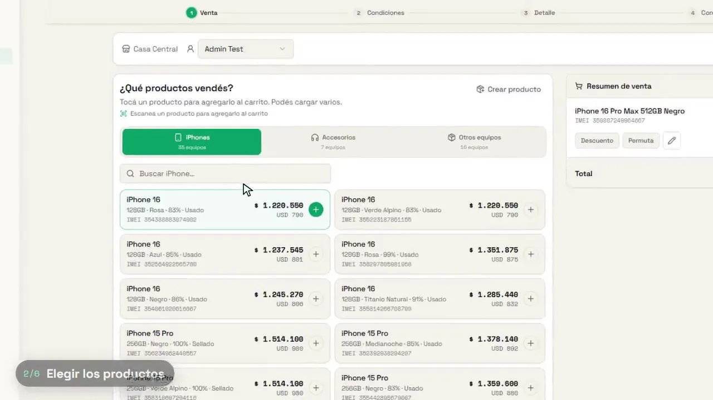
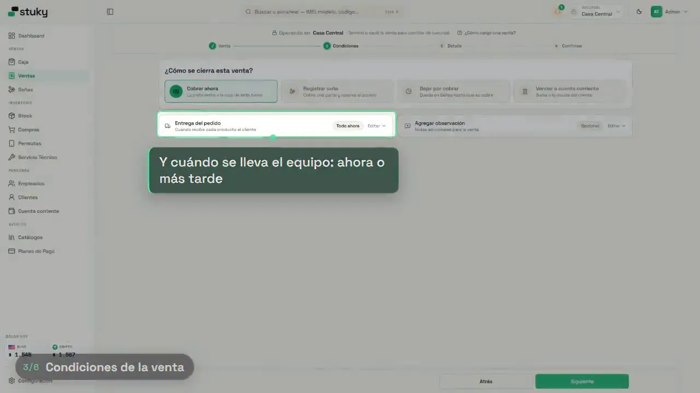
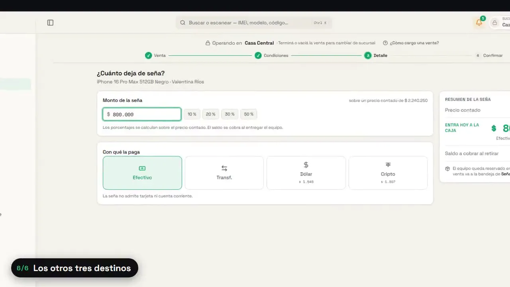

### 5. Señas (bandeja)

**Columnas:** vendedor, sucursal, precio (con cotización), seña (con el
medio), saldo, fecha y "Vence en N días".

**Cobrar el saldo:**

- Se puede cambiar la forma de pago o pagar con dos métodos, con plan de
  tarjeta.
- Muestra un desglose: precio efectivo, recargo lista, tasa tarjeta y total.
- Tiene monto recibido y vuelto.

**Otras acciones:** editar la seña, comprobante de seña, cambiar cliente y
cancelar el pedido (devuelve el stock). Las señas vencidas solo quedan
marcadas.

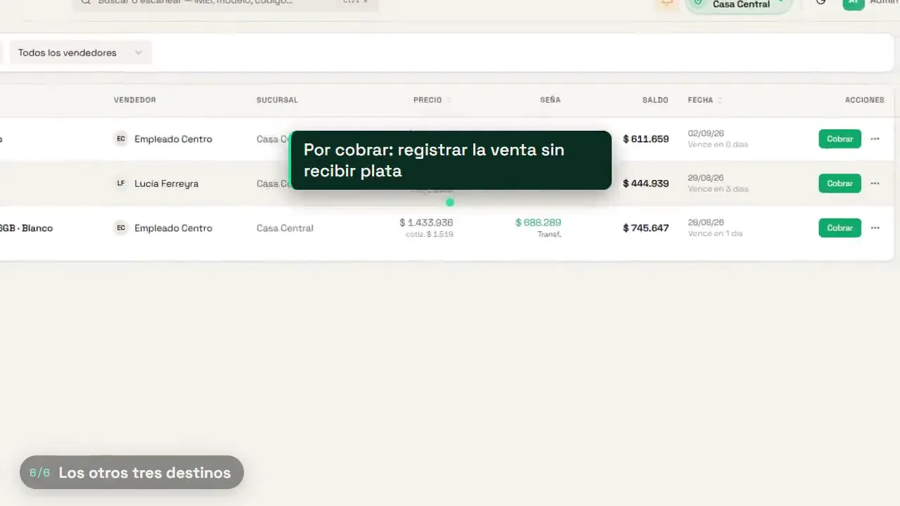

### 6. Ventas

- **Arriba:** facturado, cobrado y por cobrar. Si hay ventas históricas
  importadas, se cuentan como cobradas y no entran en Vendedores.
- **Tabla:** número, productos (con chip del medio de pago, ej. "Visa 3c"),
  fecha, cliente, vendedor, total y ganancia. La ganancia sale en verde, en
  ámbar si está pendiente o el costo está incompleto, y en rojo si hubo
  pérdida.
- **Acciones:** cambiar o asignar cliente, descargar comprobante y
  anular/devolver.
- **En el detalle:** costo e IMEI por producto, "Cargar IMEI" si falta, y
  entregar o cambiar el equipo de una venta pendiente. Si se lleva otro
  modelo, avisa si es más caro o más barato; el precio pactado no cambia.

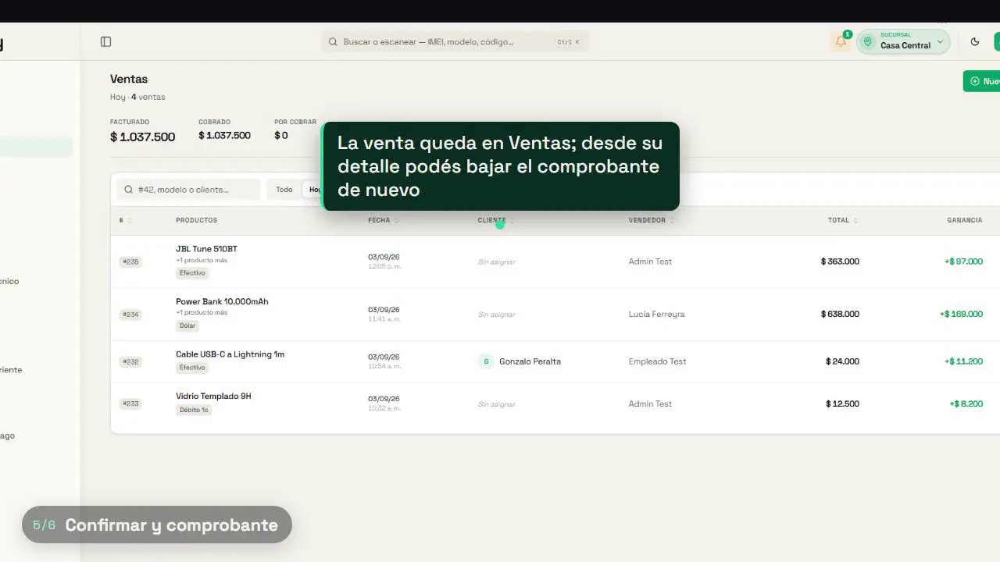

### 7. Caja

- **Apertura:** se declara el efectivo inicial. Cada sucursal tiene su turno y
  se puede cobrar en un turno que abrió otro compañero.
- **Efectivo esperado:** apertura + ventas en efectivo + servicios técnicos
  en efectivo + señas + cobros de cuenta corriente + ingresos + devoluciones
  de proveedores − pagos a proveedores − retiros.
- **Lo que va aparte:**
  - Los dólares en billetes.
  - Lo vendido a cuenta corriente ("no entra al cierre de caja").
- **Chips por medio de pago:** incluyen "N cobros de cuenta corriente por $…
  (Tarjeta $…)". Promedio de los últimos 7 días.
- **Mover efectivo:** ingreso o retiro con motivo. No se edita: si hay un
  error, se registra el movimiento contrario.
- **Cierre a ciegas:**
  - El cajero cuenta el efectivo sin ver lo esperado; solo el administrador
    (o quien tenga el permiso) ve la diferencia: sobrante o faltante.
  - No deja cerrar con pedidos sin cobrar ni con operaciones sin enviar
    desde el dispositivo.
- **Historial:** filtro por cajero, PDF por turno y PDF consolidado de
  varios turnos. Si algo se modifica después del cierre, el turno queda
  marcado como "Cierre modificado".

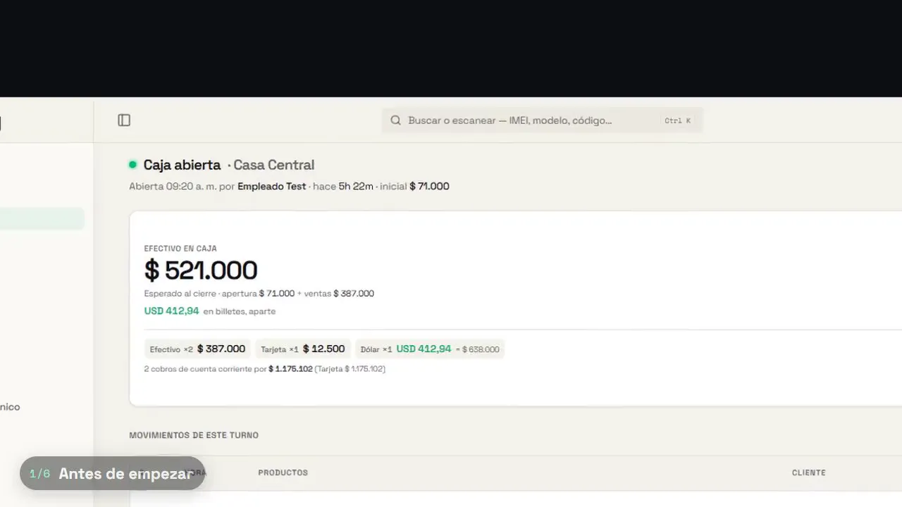

### 8. Cuenta corriente (clientes)

- **Lista:** clientes con saldo pendiente, en ARS y USD por separado. Se
  ordena por actividad, nombre o mayor saldo.
- **Extracto:** debe, haber y saldo, con moneda del extracto.
- **Registrar pago:**
  - Medio: efectivo, transferencia o tarjeta.
  - Moneda y cotización a aplicar (blue o cripto).
  - Fecha y comprobante o factura, con número.
  - Genera "Recibo N°" y entra a la caja del turno.
  - Si no hay deuda, queda como adelanto (saldo a favor).
- **Anular un pago:** pide motivo, nombre del responsable y escribir
  ANULAR.
- **Además:**
  - Observaciones internas, que no salen en los PDF.
  - Equipos por entregar.
  - Estado de cuenta por WhatsApp.
  - Tableros de "mayores deudores" y "deudas más antiguas".

### 9. Compras y proveedores

- **Proveedor:**
  - Datos: categorías que vende, CUIT, email y dirección.
  - **Plazo de pago en días**, de donde salen los vencimientos.
  - Deuda en ARS y USD por antigüedad: 1–30, 31–60 y más de 60 días.
  - Estado de cuenta.
- **Orden de compra:**
  - Pasa por borrador → ordenada (se fija la cotización y se registra la
    deuda) → recepción (con remito y parcial; el IMEI y el precio de venta
    se cargan al recibir) → recibida.
  - Se puede duplicar y bajar en PDF.
  - Acepta descuento (ajusta lo que se paga, no el costo) y costo neto + IVA.
- **Pagos:**
  - Medio: efectivo, transferencia, tarjeta o e-cheq (con fecha de
    acreditación).
  - Casilla **"Sale de la caja"**: el efectivo puede salir de otro lado,
    como una caja fuerte.
  - Al anular un pago en efectivo, pregunta qué pasó con la plata: fue un
    error de carga, el proveedor la devolvió (entra a la caja de hoy) o se
    devolvió por fuera de la caja.
- **Notas de crédito y devoluciones:** la devolución saca las unidades del
  stock.

### 10. Permutas

- **Catálogo de valores de toma:**
  - Por modelo, capacidad y **4 tramos de batería**, en USD o ARS.
  - Ajuste masivo por % o monto fijo. Avisa que subir y bajar el mismo % no
    vuelve al valor original.
- **Bandeja de equipos recibidos:** estados Ofrecida, Recibida, En stock y
  En técnico. Desde ahí se mandan a stock o a técnico (se crea la orden con
  la descripción del problema).

### 11. Clientes, reportes, empleados y configuración

- **Clientes:** segmentos Todos, Nuevos este mes, Recurrentes (2 o más
  compras) y Sin compras. Se pueden fusionar; eliminar solo los desactiva y
  conserva el historial.
- **Reportes:**
  - Período por meses o por rango.
  - Números contra el período anterior: ventas, facturado, cobrado, ganancia
    y ticket promedio.
  - Tarjetas de unidades, descuentos otorgados, ventas a pérdida y vendido
    a cuenta corriente.
  - Destacados: mejor día, producto, vendedor y medio más usado.
  - Rankings por vendedor, producto, categoría (margen % y % de la
    facturación) y medio de pago.
- **Empleados:**
  - Unos 30 permisos individuales agrupados. Ejemplos: *ver el efectivo
    esperado*, *ver ventas de todos*, *anular ventas*, *aplicar descuentos*,
    *ver costos y ganancia*, *fiar y cobrar cuenta corriente*, *cambiar
    precios de venta*.
  - Registro de actividad y sesiones que se pueden cerrar a distancia.
- **Terminales:** se vincula la PC del mostrador a una sucursal. El equipo
  entra eligiendo su perfil, sin contraseña; el administrador entra con un
  PIN de 6 dígitos.
- **Configuración:**
  - Cotización, Recargo, Monedas (una por categoría) y Garantía (duración,
    condiciones y vigencia de la seña).
  - Mis datos (logo y datos del comprobante), Sesiones y Suscripción.
- **Asistente inicial:** el paso 3 es "¿Cómo maneja hoy el negocio?" (Excel,
  cuaderno, otro sistema o nada). Hay un paso "Sus ubicaciones": hasta 2
  durante la prueba.

### 12. Capturas con la sesión abierta (las pasó el dueño, 30/09/2026)

Son de la cuenta de prueba, en modo oscuro. Confirman lo que decía el código
y agregan algunos detalles:

- **Menú:** "Equipo" (no "Empleados") en Personas. La cotización del día
  (blue y cripto) queda siempre abajo del menú, arriba de Configuración.
- **Cuenta corriente vacía:** tiene dos solapas, Cuentas y Reportes.
  - A la izquierda, un buscador de cliente con botón de orden.
  - A la derecha, el mensaje "Elija un cliente de la lista para ver su
    cuenta".
  - Arriba a la derecha, "0 clientes con saldo pendiente".
- **Nuevo cliente:** solo el nombre es obligatorio.
  - A la vista: DNI (sin puntos ni guiones) y teléfono.
  - En "Más datos": email, dirección, localidad y observaciones internas
    ("No las ve el cliente").
- **Nuevo iPhone desde la venta:** si un equipo no está en stock, se da de
  alta sin salir de la venta (`/admin/ventas/nuevo?clienteId=…`). El
  formulario tiene tres bloques:
  - **Equipo:** modelo con buscador, condición (Usado o Sellado) y
    almacenamiento.
  - **Precio y costo:** el precio de venta en USD; el costo en USD o ARS.
  - **Identificación:** IMEI (15 dígitos, acepta el lector de código),
    código de barras y "Agregar IMEI 2".
- **Configuración:**
  - Es un **modal con menú a la izquierda**: Cotización, Recargo, Monedas,
    Garantía, Mis datos, Sesiones y Suscripción.
  - Al pie del menú, "Configuración inicial" (para volver a abrir el
    asistente) y **la versión (v0.27.1)**.
  - *Cotización:* solapas Dólar blue y Dólar cripto, con la etiqueta
    "Automático (dolarapi.com)". Muestra el valor grande ($1.560 ARS por
    USD) y un ejemplo en una línea: "Un producto de USD 100 se cobra
    $156.000". Tiene "Cargar valor manual".
  - *Suscripción:* "Período de prueba · PRO gratuito · 30 días restantes".
    Para renovar hay que escribirles.

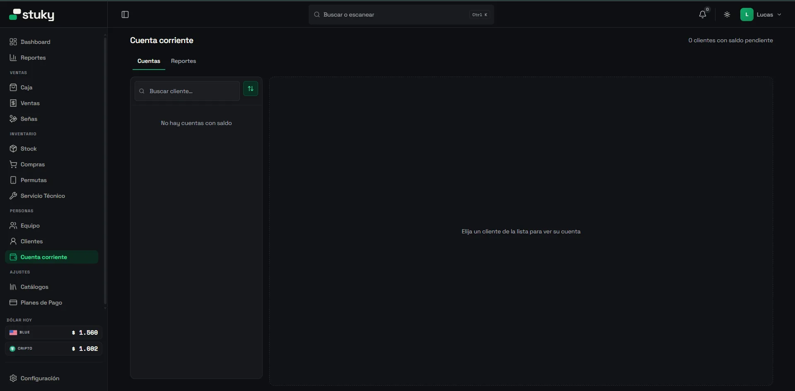
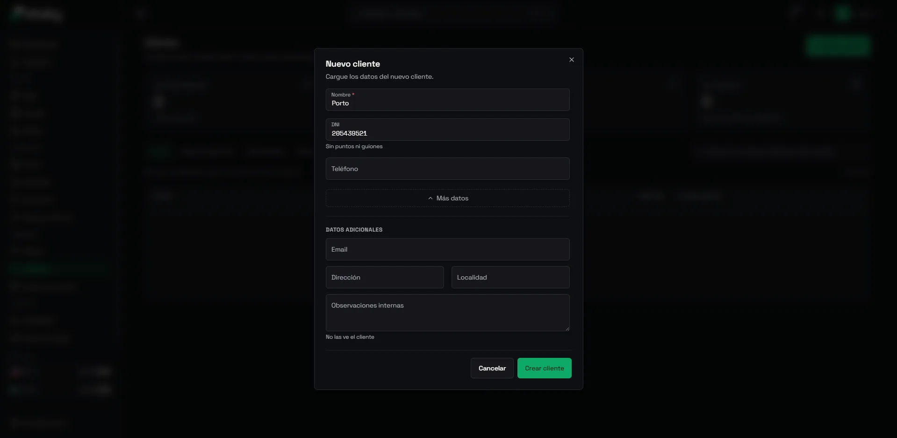
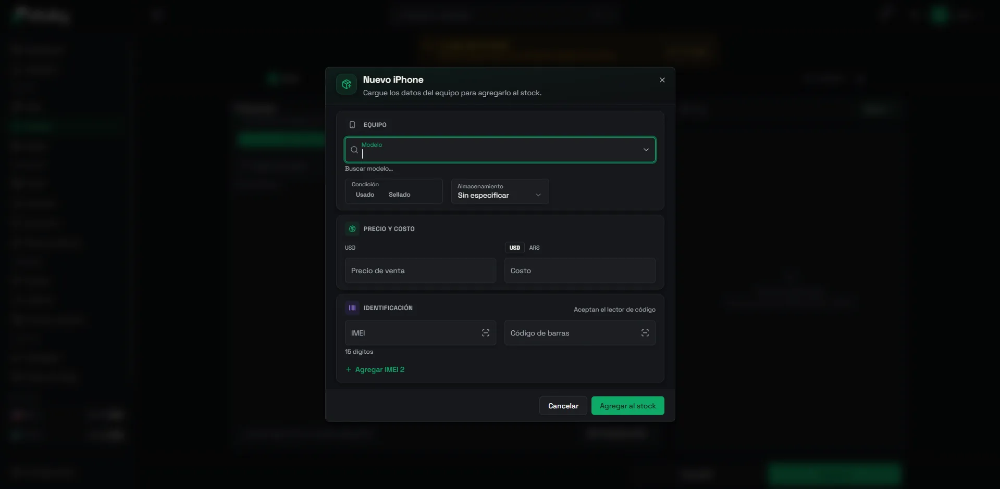
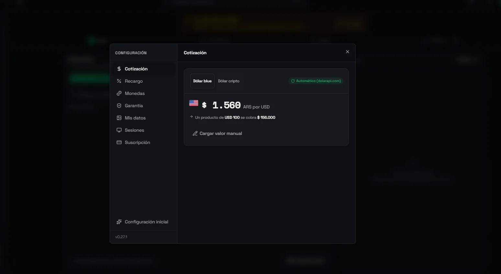
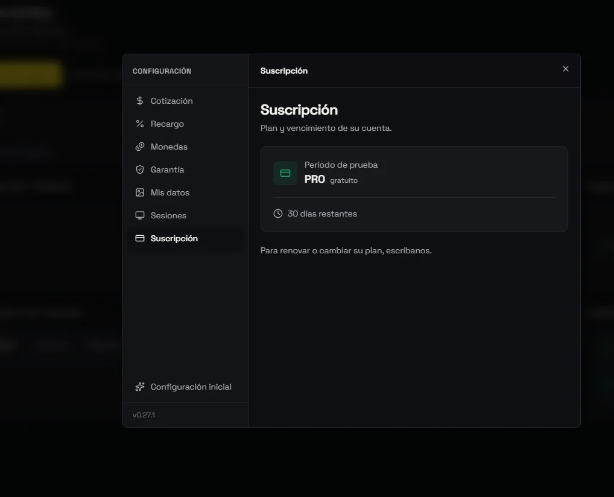

---

## Stackr hoy frente a Stuky (en lo prioritario)

| Tema | Stackr hoy | Stuky |
|---|---|---|
| Plan de tarjeta | Un % de recargo por plan y quién lo paga (cliente o **local**). Ya existe el campo "Acredita en", pero apunta a un depósito y **nada lo usa**. | Recargo de lista por categoría + interés + IVA sobre el interés. Siempre paga el cliente. |
| Ganancia con tarjeta | Precio de lista − costo − lo que absorbe el local (`utils/tarjetas.ts`). El recargo que paga el cliente no es ganancia. | Precio contado − costo − descuento. El recargo "compensa la tarjeta, no es ganancia". |
| Arancel real de la tarjeta o financiera | No | No |
| Financiación propia | Cuotas con interés opcional; **el interés suma a la ganancia** (`utils/cuotas.ts`). Cuotas vencidas en el dashboard. | Cuenta corriente sin interés, con plazo; ganancia marcada "pendiente de cobro". |
| Destino de la transferencia | No (solo "Transf. ARS" / "Transf. USD"; el saldo es por depósito). | No |
| Lo cobrado con recargo | `card_charged` se guarda en la venta, pero **solo se ve en la pantalla de venta**. La vista de Cajeros no muestra la tarjeta (solo efectivo, transferencias y cripto). | Se ve en el detalle, en la seña y en la caja. |

En ganancia, Stackr ya está un paso adelante: contempla que el local absorba
el recargo y que el interés de la financiación propia sea ganancia. Lo que le
falta a los dos es **a dónde entra la plata**.

## Propuesta para Stackr (sin perder simplicidad)

Ordenada por impacto y esfuerzo. Lo marcado **(no copiar)** se descarta a
propósito.

### A. "Cuentas": a dónde entra la plata (resuelve la transferencia a la financiera)

**En Ajustes:** una lista corta de cuentas.

- Cada cuenta tiene nombre, tipo y moneda.
- Tipos: *Banco / billetera*, *Financiera*, *Procesadora de tarjeta*.
- Ejemplos: "Galicia", "Mercado Pago", "Financiera X".

**En la venta:**

- Si hay **una sola** cuenta de transferencias, no cambia nada: se usa esa.
- Si hay **más de una**, al elegir Transferencia aparece "¿A qué cuenta?",
  con la última usada preseleccionada.
- Se guarda `account_id` en el pago, dentro del JSON `sales.payments`. No
  hace falta cambiar la tabla `sales`.

**Reusar lo que ya existe:**

- El "Acredita en" del plan de tarjeta pasa a elegir una **cuenta** en vez de
  un depósito. Hoy no lo usa nada, así que el cambio no rompe datos.

**Lo que se ve:**

- En Caja/Cajeros, un bloque "Por cuenta" con lo que entró a cada una en el
  período, además del efectivo por depósito.
- Una transferencia que el cliente le hace a la financiera queda como
  ingreso en la cuenta "Financiera X", no en la caja del local.

**Base de datos:** una tabla nueva `accounts` (org_id, name, type, currency,
active). Es aditiva, siguiendo el formato de `docs/mejoras/README.md`.

### B. Venta a través de una financiera (la ganancia real)

Se reutiliza el plan de tarjeta en lugar de crear una pantalla nueva:

- "Plan de tarjeta" pasa a llamarse **"Plan de tarjeta o financiera"**.
- Un plan de financiera con "Lo absorbe el local" y el % que retiene la
  financiera ya da la ganancia correcta: precio − costo − retención. Es la
  lógica que ya está en `resumenPlan`.
- Con "Acredita en = Financiera X" (punto A) se sabe dónde queda la plata.
- **Opcional, en una segunda etapa:** "días hasta acreditar" en el plan, para
  mostrar en el dashboard un "Por acreditar" (tarjetas y financieras)
  separado de lo cobrado. Solo si el dueño lo pide: agrega estado.

### C. Mostrar en todos lados lo que ya se calcula

Es el hueco de "información que aparece en una pantalla y falta en otra":

- **En el detalle de venta, el comprobante y la lista de ventas:** separar
  "Cobrado al cliente" (precio + recargo = total, con el plan "Visa 3c") de
  "Ganancia", con la leyenda de Stuky: *el recargo compensa la tarjeta, no es
  ganancia*. Los datos (`card_charged`, `card_surcharge_pct`, `card_paid_by`)
  ya están guardados.
- **Chip del medio de pago en la lista de ventas**, como "Visa 3c" o
  "Transf. · Galicia".
- **Ganancia en ámbar "pendiente de cobro"** en ventas con cuotas propias que
  todavía no se cobraron. La ganancia se sigue contando el día de la venta,
  pero se ve que falta la plata.

### D. Detalles chicos de la pantalla de venta

- Panel **"Entra hoy a la caja"** en el resumen del pago: cuánto entra en
  efectivo, en cada cuenta y a crédito.
- Botones rápidos de seña (10, 20, 30 y 50%) y de "¿con cuánto paga?" para
  el vuelto.
- Mostrar en cada plan el total y la cuota **antes** de elegirlo, como en
  `app-pago-tarjeta.webp`.

### E. Para más adelante (valen la pena, pero no son prioridad)

- **Cierre de caja a ciegas**, con permiso para ver lo esperado.
- **Casilla "Sale de la caja"** al pagar a un proveedor en efectivo.
- **Valores de toma de permutas por tramo de batería.**

### F. Configuración ordenada en secciones, con la versión a la vista

Al dueño le gustó especialmente cómo lo resuelve Stuky.

**Hoy en Stackr**, Ajustes (`src/app/(app)/settings/SettingsClient.tsx`) es
una sola página larga. Se mezclan comercio, recibo, cotización, planes de
tarjeta, API y backup.

**La propuesta:**

- **Un menú lateral con pocas secciones.** En el celular, el menú pasa arriba
  como lista. Por ejemplo:
  - Cotización.
  - Cobros: planes de tarjeta y financieras, y las cuentas del punto A.
  - Mi comercio y recibo.
  - Garantía.
  - Suscripción.
  - Avanzado: API y backup.
- **Al pie del menú, la versión de Stackr.** Sirve para soporte ("¿qué
  versión ves?") y para avisar novedades. Hoy `package.json` dice 0.1.0 y
  no se muestra en ningún lado.
- **En Cotización, el ejemplo en una línea**, como hace Stuky: "Un producto
  de USD 100 se cobra $…". Se entiende el número sin explicar nada.

Es solo reordenar lo que ya existe; no agrega funciones.

### (no copiar)

- **Recargo de lista por categoría + interés + IVA sobre el interés.** Son tres
  capas para llegar a un número. El % único por plan de Stackr es más simple y
  da el mismo total.
- **Cuenta corriente solo para iPhone y sin mezclar medios de pago.** Es una
  restricción de Stuky, no una ventaja.
- **Terminales con PIN, órdenes de compra con borrador, recepción y remito, y
  30 permisos individuales.** Suman pantallas; conviene esperar a que un
  cliente los pida.

## Pendiente (requiere acceso a `api.stukysistema.com`)

- Cargar ventas de prueba con transferencia, tarjeta en cuotas, seña y
  cuenta corriente. Verificar con números reales que la ganancia del
  servidor coincide con lo que dicen las leyendas.
- Capturas de Planes de pago, Configuración → Recargo, detalle de venta con
  tarjeta, cierre de caja, compras y reportes. Cotización y Suscripción ya
  están (sección 12).
